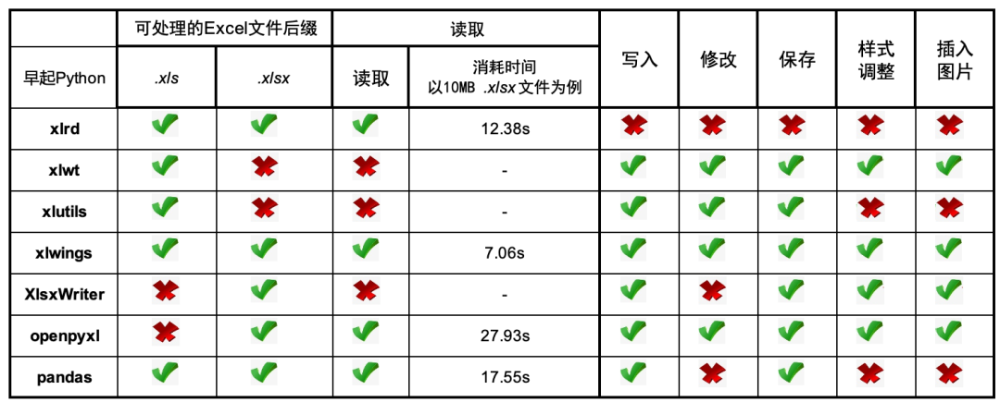
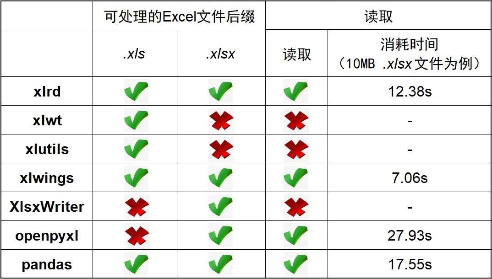

# python使用excel的一些知识

## 1.基础知识

### a. `xlrd`、`xlwt`、`xlutils` 各自的功能都有局限性，但三者互为补充，覆盖了Excel文件尤其是 `.xls` 文件的操作。`xlwt` 可以生成 `.xls` 文件，`xlrd` 可以读取已经存在的 `.xls` 文件，`xlutils` 连接 `xlrd` 和 `xlwt` 两个模块，使用户可以同时读写一个 `.xls` 文件。简单来说，`xlrd` 负责读、`xlwt` 负责写、`xlutils` 负责提供辅助和衔接

### b. `xlwings` 能够非常方便的读写 Excel 文件中的数据，并且能够进行单元格格式的修改

### c. `XlsxWriter` 是一个用来写 `.xlsx` 文件格式的模块。它可以用来写文本、数字、公式并支持单元格格式化、图片、图表、文档配置、自动过滤等特性。但不能用来读取和修改 Excel 文件

### d.`openpyxl` 通过 工作簿 “workbook - 工作表 sheet - 单元格 cell” 的模式对 `.xlsx` 文件进行读、写、改，并且可以调整样式

### 

## 2.读取文件

### a.`xlwt`、`xlutils`、`XlsxWriter` 不能读取文件

### b.`xlrd` 可以读取 `.xls` 和 `.xlsx` 文件

### c.`xlwings` 可以读取 `.xls` 和 `.xlsx` 文件

### d.`openpyxl` 可以读取 `.xlsx` 文件

### e.`pandas` 可以读取 `.xls` 和 `.xlsx` 文件

## 3.创建Excel文件

### a.`xlrd`、`xlutils` 不能创建 Excel 文件

### b.`xlwt` 只能创建 `.xls` 文件，不能创建 `.xlsx` 文

### c.`xlwings`可以创建 `.xls` 和 `.xlsx` 文件

### d.`XlsxWriter` 可以创建 `.xlsx` 文件

### e.`openpyxl` 可以创建 `.xls` 和 `.xlsx` 文件

### f.`pandas` 没有创建 Excel 的概念，但可以存储时产生 `.xls` 或 `.xlsx` 文件

## 4.保存文件

###  a.`xlrd` 不能保存 Excel 文件

###  b.`xlwt` 可以保存 `.xls` 文件

###  c.`xlutils` 可以将 `xlrd` 对象复制为 `xlwt` 对象后保存 `.xls` 文件

###  d.`xlwings`可以保存 `.xls` 和 `.xlsx` 文件

###  e.`XlsxWriter` 可以保存 `.xlsx` 文件

###  f.`openpyxl` 可以保存 `.xlsx` 文件

###  g.`pandas` 可以保存 `.xls` 或 `.xlsx` 文件

[参考资料](https://mp.weixin.qq.com/s/wqMOLQ7t9fFOXC7naiGEHA)

